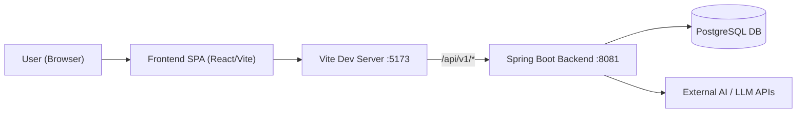

# TruthByte

AI-powered misinformation detection and claim verification platform.

TruthByte combines a Spring Boot backend with a modern React/Vite frontend to help users verify claims, analyze URLs, and explore community intelligence around online content.

---

## Overview

- **Type**: Full‑stack web application (API + SPA)
- **Backend**: Java 17, Spring Boot, JPA, PostgreSQL
- **Frontend**: React 18, Vite, TypeScript, Tailwind CSS, Radix UI
- **Goal**: Provide fast, explainable fact‑checking tools and dashboards for misinformation analysis.

---

## Architecture

The project is split into two clearly separated modules:

- [backend](backend/) – Spring Boot REST API, security, persistence and integrations
- [frontend](frontend/) – Vite + React single‑page application (SPA) consuming the API

Vite is configured to proxy `/api` calls to the backend during local development so the UI can talk to the API without CORS issues.

### High‑level flow

1. User interacts with the UI (e.g. submit claim, analyze URL, open dashboard).
2. Frontend sends requests to `/api/v1/...` via the Vite dev server.
3. Backend processes the request, talks to the database and external AI services, and returns structured results.
4. Frontend renders results with charts, cards, and dashboards.

### Architecture diagram

---

## Project structure

- [backend](backend/)
  - Java 17 / Spring Boot entry point
  - Maven build (pom.xml inside backend/)
  - Application configuration in [backend/src/main/resources/application.yml](backend/src/main/resources/application.yml)
- [frontend](frontend/)
  - Vite + React + TypeScript SPA
  - UI components and routes under [frontend/src/app](frontend/src/app)
  - Global styles under [frontend/src/styles](frontend/src/styles)
- [guidelines](guidelines/) – project guidelines and startup notes
- [ATTRIBUTIONS.md](ATTRIBUTIONS.md) – third‑party attributions

---

## Prerequisites

- Node.js (LTS recommended)
- npm (bundled with Node.js)
- Java 17+
- Maven 3+
- PostgreSQL (or compatible database) configured to match the settings in application.yml

---

## Backend – local development

1. Open a terminal in the repository root.
2. Change into the backend module:
   - `cd backend`
3. (Optional) Build and run tests:
   - `mvn clean test`
4. Start the Spring Boot application:
   - `mvn spring-boot:run`

The backend typically listens on `http://localhost:8081` and exposes REST endpoints under `/api/v1/...`.

Ensure your database configuration and environment variables match the values in [backend/src/main/resources/application.yml](backend/src/main/resources/application.yml).

---

## Frontend – local development

1. Open a terminal in the repository root.
2. Change into the frontend module:
   - `cd frontend`
3. Install dependencies (first time or when packages change):
   - `npm install`
4. Start the Vite development server:
   - `npm run dev`

By default the frontend runs on `http://localhost:5173` and proxies API calls from `/api` to the backend on `http://localhost:8081`.

---

## Environment configuration

### Backend

- Backend environment variables are read via Spring Boot configuration in [backend/src/main/resources/application.yml](backend/src/main/resources/application.yml).
- A `.env` file in the backend module can be used if configured there (see guidelines in [guidelines/StartupGuide.md](guidelines/StartupGuide.md)).

### Frontend

- Create a `.env` file inside the frontend folder if you need to override the default API base URL:
  - `frontend/.env`
  - Example:
    - `VITE_API_BASE_URL=https://your-backend-url/api/v1`

---

## Production build

### Backend

- From the backend module:
  - `cd backend`
  - `mvn clean package`
- This produces an executable JAR under `backend/target` which can be deployed to your runtime environment.

### Frontend

- From the frontend module:
  - `cd frontend`
  - `npm run build`
- The optimized static assets are generated in `frontend/dist` and can be served by any static file server or integrated behind the backend.

---

## Development scripts (summary)

- Backend:
  - `mvn spring-boot:run` – run API locally
  - `mvn test` – run backend tests (if present)
- Frontend:
  - `npm run dev` – start Vite dev server
  - `npm run build` – create production build
  - `npm run lint` – run ESLint on frontend code

---

## Author

This project is maintained by **Md Shahbaz Imam**.

  